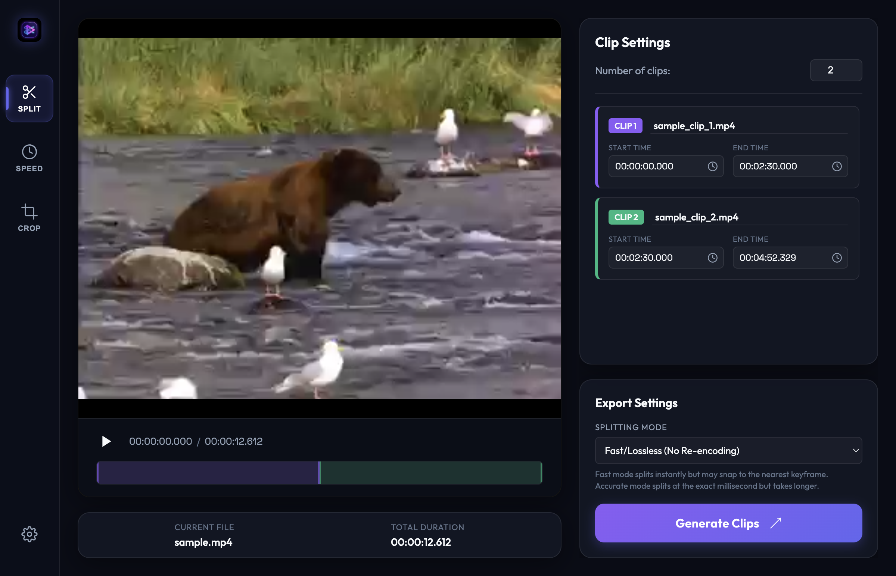
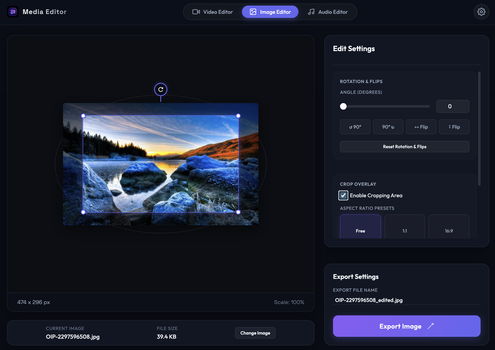

# macOS Media Editor

A beautiful, high-fidelity macOS desktop application designed to edit and split video and image files quickly and losslessly. Built on top of Electron, this application provides a native macOS dark-mode user experience with interactive timeline scrubbers, canvas-based image manipulators, dynamic clip-range overlays, and high-performance FFmpeg operations.



---

## App Sections & Key Features

### 🎬 Video Editor Section
The Video Editor provides high-speed, interactive tools to manage and modify video files:
*   **Drag & Drop Import**: Quickly import any video file (`.mp4`, `.mov`, `.mkv`, `.avi`, `.webm`) by dragging it into the window or using the native macOS file picker.
*   **Video Splitter Tool**: Split a single video into any number of clips, with real-time color-coded range overlays on the timeline and precise "Use Current Time" timestamp sync.
*   **Video Speed Changer Tool**:
    *   *Constant Speed*: Standard uniform speed multiplier (from `0.25x` to `10.0x`).
    *   *Speed Ramp*: Symmetrical progressive bell-curve acceleration/deceleration using custom 5-slice FFmpeg speed filters.
    *   *Sync Pitch*: Audio pitch and speed stay perfectly synchronized.
    *   *Video-only Fallback*: Runs speedups automatically on videos without audio streams.
*   **Video Frame Cropper Tool**:
    *   Interactively adjust the crop region on the video frame using a draggable/resizable overlay.
    *   Aspect ratio lock presets (`Freeform`, `1:1 Square`, `16:9 HD`, `9:16 Portrait`, `4:3 TV`).
    *   Enter precise manual pixel coordinates (X, Y, Width, Height) directly.
*   **Video Reverser Tool**:
    *   *Reverse Playback Preview*: Preview videos backwards in real time using the reverse play control button.
    *   *Reversed or Muted Audio*: Reverses audio streams in synchronization or mutes audio if desired.
    *   *Auto-fallback*: Seamlessly bypasses audio reversing if no audio stream is present in the source file.
*   **Video Logo & Text Eraser Tool**:
    *   *Draggable Erase Region Overlay*: Draw a red, resizable boundary overlay box over any logo, watermark, or text overlay on the video frame.
    *   *Multiple Erase Styles*:
        *   *Smooth Blur (Gaussian)*: Crops the target region, applies a smooth `boxblur`, and overlays it back for a clean watermark blur.
        *   *Solid Color Block (Blackout)*: Covers the target region with a solid black rectangle using the `drawbox` filter.
        *   *Pixel Interpolation (Delogo)*: Blends/interpolates the selected region using the surrounding frame pixels via FFmpeg's `delogo` filter.
    *   *Manual Dimension Inputs*: Fine-tune removal coordinates precisely in the sidebar.
*   **Dual Export Modes**:
    *   *Fast/Lossless (Instant)*: Employs FFmpeg's stream copy (`-c copy`) to extract segments in milliseconds without quality loss.
    *   *Frame-Accurate (Precise)*: Re-encodes using H.264/AAC to cut video at the exact millisecond.

### 🖼️ Image Editor Section
A fully featured client-side canvas image editor:
*   **Drag & Drop Import**: Import images (`.png`, `.jpg`, `.jpeg`, `.webp`, `.gif`, `.bmp`) by dragging or browsing files.
*   **Precision Rotation & Mirroring**:
    *   Rotate images interactively using a visual circular rotation handle.
    *   Fine-tune using a slider or entering precise degrees (`-360°` to `360°`).
    *   Quick rotation buttons (`↺ 90°` / `90° ↻`) and mirroring flips (horizontal/vertical).
    *   Calculates rotated canvas bounds dynamically using automated helper functions to ensure no pixel clipping.
*   **Draggable Crop Box Overlay**:
    *   Dashed visual crop frame with four corner handles, dimmed outer margins, and aspect ratio constraint snapping (`Free`, `1:1`, `16:9`).
    *   Synchronized manual input fields for X, Y, Width, and Height.
*   **Photo Quality Enhancer**:
    *   Adjust **Crisp Sharpening** (via spatial 2D convolution matrix), **Color Boost** (saturation), **Auto-Contrast**, and **Noise Reduction** sliders to enhance photo details.
    *   Interactive live-preview rendering updates the canvas in real time.
*   **Print & Download Sizing Presets (300 DPI)**:
    *   Select standard print sizes: 4"x6" Photo (1200x1800 px), 5"x7" Portrait (1500x2100 px), 8"x10" Gallery (2400x3000 px), 11"x14" Premium Art (3300x4200 px), **18"x24" Poster Size** (5400x7200 px), or A4 Sheet (2480x3508 px) in either Landscape or Portrait orientation.
    *   The crop overlay automatically locks to the chosen print size aspect ratio and upscales/downscales with high-quality cubic interpolation.
    *   Custom scale multipliers: 2x, 3x, and 4x.
*   **Collapsible sidebar inspectors**: Card panels can be expanded or collapsed to maximize screen space, featuring chevron indicator animations and smooth transitions.
*   **Pixel-Perfect Export**: Exports the rotated, cropped, enhanced, and scaled region directly onto a clean canvas buffer and saves it as a high-fidelity image file.

### 🎵 Audio Editor Section
*   A placeholder tab showing a premium **"Coming Soon"** splash screen.
*   Includes a beautiful glowing CSS-animated bouncing waveform demonstrating active channel visualization.

---

## Tech Stack

*   **Runtime Framework**: Electron (v30)
*   **Frontend**: Vanilla HTML5, CSS3 (CSS Variables, Flexbox, Keyframes, Custom Scrollbars), Vanilla JavaScript (Context Isolated Preload Bridge)
*   **Video Engine**: FFmpeg (static macOS binaries bundled via `ffmpeg-static`)
*   **Image Processing Engine**: HTML5 Canvas 2D API
*   **Unit Testing**: Vitest (v1.6)

---

## Prerequisites

Make sure you have Node.js and npm installed on your Mac:
*   **Node.js**: `v18` or higher (tested on `v24.14.0`)
*   **npm**: `v9` or higher (tested on `11.9.0`)

No external installation of FFmpeg, Homebrew, or ImageMagick is required; the application bundles all necessary dependencies natively.

---

## Installation & Setup

1.  **Clone the repository**:
    ```bash
    git clone <repository-url>
    cd media-editor
    ```

2.  **Install dependencies locally**:
    ```bash
    npm install
    ```

3.  **Run the application in development**:
    ```bash
    npm start
    # or
    npm run dev
    ```

4.  **Run unit tests**:
    ```bash
    npm run test
    ```

---

## Packaging as a macOS App (Double-Clickable)

To compile the application into a double-clickable macOS desktop `.app` bundle, run:
```bash
npm run package
```
This compiles the application and generates the app bundle in:
`./dist/mac-arm64/Media Editor.app` (or `./dist/mac/` depending on processor architecture).

### macOS Security Gatekeeper Workaround (For Unsigned Local App)
Since the app is built locally without an Apple Developer certificate, macOS Gatekeeper will block the application on the first double-click. To open it:
1.  **Open Finder** and navigate to `./dist/mac-arm64/`.
2.  **Right-Click (Control-Click)** the **Media Editor.app** file.
3.  Click **Open** from the context menu.
4.  Select **Open** again in the macOS warning dialog.
5.  The application will now launch and will open instantly on all subsequent double-clicks.

---

## Usage Guide

### General Navigation
Use the header tabs (**Video Editor**, **Image Editor**, **Audio Editor**) to navigate between the app's main components. Switching away from the video editor will automatically pause any active video playback.

### 🎬 Video Editing

#### Video Splitter Mode
1.  In the **Splitter** tab, configure the number of clips you want to extract.
2.  Scrub through the video and click the **Use Current Time** button next to start/end inputs to capture timestamps, or enter them manually.
3.  Select *Fast/Lossless* or *Frame-Accurate* modes.
4.  Click **Generate Clips**, choose an export folder, and click **Open in Finder** when done.

#### Video Speed Changer Mode
1.  Choose between **Constant Speed** or **Speed Ramp**.
2.  Adjust the custom speed multiplier factor or click presets.
3.  Enter/check the output filename and click **Apply Speed & Export**.

#### Video Frame Cropper Mode
1.  Select the **Cropper** tab to show the video crop frame.
2.  Position and resize the overlay box using the handles, or configure X/Y coordinate inputs.
3.  Click **Apply Crop & Export**.

#### Video Reverser Mode
1.  Select the **Reverse** tab in the sidebar.
2.  Choose whether to reverse the audio track or mute it using the **Reverse Audio** checkbox.
3.  Use the **Play Reverse** button in the player controls row to preview the reversed video.
4.  Enter/check the output filename and click **Reverse & Export**.

#### Video Logo & Text Eraser Mode
1.  Select the **Erase** tab in the sidebar (represented by the eraser icon).
2.  Choose the preferred **Erase Style** from the dropdown menu (**Smooth Blur (Gaussian)**, **Solid Color Block (Blackout)**, or **Pixel Interpolation (Delogo)**).
3.  Adjust the red dashed overlay box over the logo or text overlay on the video player (or enter X, Y, Width, and Height dimensions manually in the sidebar).
4.  Enter/check the output filename and click **Apply Erase & Export**.

### 🖼️ Image Editing

1.  Click the **Image Editor** tab.
2.  Drag and drop an image or click **Browse Image** to load.
3.  **Rotate / Flip**: Use the top visual handle to rotate by dragging, adjust the slider, or click preset rotation/mirroring buttons.
4.  **Crop**: Check **Enable Cropping Area**. Drag the visual frame boundaries or corner knobs, or enter precise coordinates in the sidebar. Select aspect ratio presets to lock dimensions.
5.  **Export**: Enter the output filename, click **Export Image**, and choose a destination folder.



---

## Testing

This project uses Vitest to verify duration conversions, timestamp parsing, FFmpeg command generation, and image rotated bounding-box calculations. The test suite is located in `./helpers.test.js` and can be run with:
```bash
npm run test
```

---

## Project Structure

*   [main.js](./main.js) - Spawns Electron windows, sets up native IPC handlers (`select-image-file`, `save-image-file`, etc.), custom local protocols, and triggers FFmpeg child processes.
*   [preload.js](./preload.js) - Exposes secure context-isolated APIs to the renderer process.
*   [renderer.js](./renderer.js) - Manages application logic, tab switches, timeline interfaces, rotation handlers, cropping states, and Canvas exports.
*   [helpers.js](./helpers.js) - Shared mathematical and time-formatting utilities.
*   [helpers.test.js](./helpers.test.js) - Automated unit tests for helpers.
*   [index.html](./index.html) - Structural application markup.
*   [style.css](./style.css) - Global dark mode variables, structural layouts, and bouncing audio waveforms.
