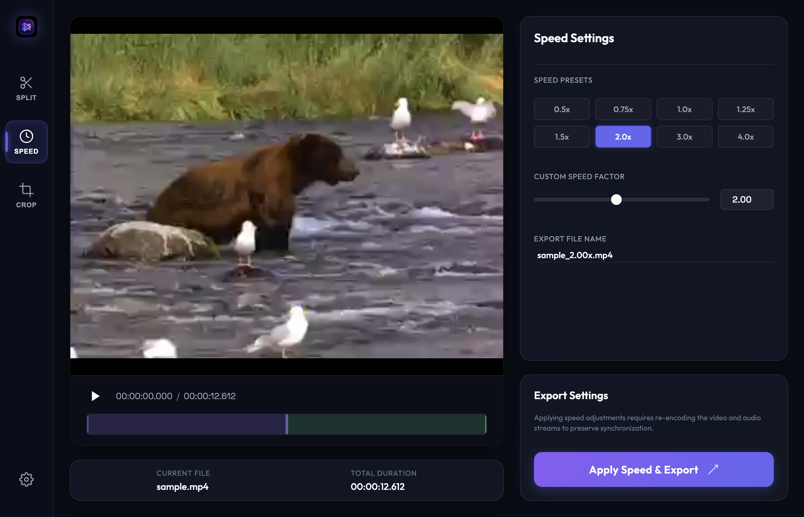
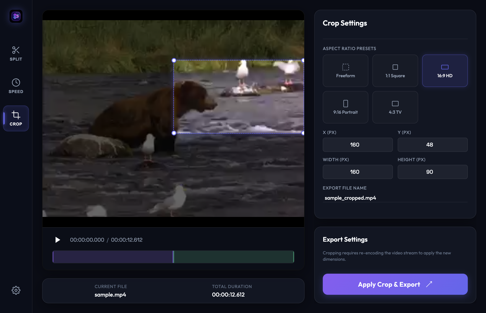

# macOS Media Splitter & Editor

A beautiful, high-fidelity macOS desktop application designed to split video files into multiple clips quickly and losslessly. Built on top of Electron, this application provides a native macOS dark-mode user experience with interactive timeline scrubbers, dynamic clip-range coloring, and high-performance ffmpeg operations.


---

## Key Features

- **Drag & Drop Import**: Quickly import any video file (`.mp4`, `.mov`, `.mkv`, `.avi`, `.webm`) by dragging it into the window or using the native macOS file picker.
- **Video Splitter Tool**: Split a single video into any number of clips, with real-time color-coded range overlays on the timeline.
- **Video Speed Changer Tool**:
  - **Speed Modes**: Toggle between **Constant Speed** (uniform speed change) and **Speed Ramp** (progressive symmetrical bell-curve acceleration/deceleration).
  - Speed up or slow down videos (from `0.25x` to `10.0x`) using custom sliders, inputs, or standard presets.
  - Multi-tempo audio filter chaining keeps audio pitch and speed perfectly in sync.
  - Symmetrical 5-slice speed ramping splits, trims, scales, and concatenates audio/video streams dynamically.
  - Smart fallback runs video-only speedups or ramps if the input has no audio track.
- **Video Frame Cropper Tool**:
  - Interactively select regions of the video frame using a draggable/resizable visual crop box.
  - Lock aspect ratios to standard presets (`Freeform`, `1:1 Square`, `16:9 HD`, `9:16 Shorts`, `4:3 TV`).
  - Enter precise native pixel coordinates (X, Y, Width, Height) directly using the coordinate inputs.
  - Re-encodes video using H.264 with an automatic audio fallback if the file has no audio stream.
- **Precision Time Syncer**: Sync clip start/end times directly with the video player's current playback position via one-click "Use Current Time" buttons.
- **Dual Splitting Modes**:
  - **Fast/Lossless (Instant)**: Employs FFmpeg's stream copy (`-c copy`) to extract segments in milliseconds without re-encoding quality loss.
  - **Frame-Accurate (Precise)**: Re-encodes using H.264/AAC to cut video at the exact millisecond.
- **Finder Integration**: Open the output directory directly in macOS Finder immediately after processing.

---

## Tech Stack

- **Framework**: Electron (v30)
- **Frontend**: Vanilla HTML5, CSS3, JavaScript (UMD modular patterns)
- **Video Engine**: FFmpeg (via `ffmpeg-static` node module)
- **Unit Testing**: Vitest (v1.6)

---

## Prerequisites

Make sure you have Node.js and npm installed on your Mac:
- **Node.js**: `v18` or higher (tested on `v24.14.0`)
- **npm**: `v9` or higher (tested on `11.9.0`)

No external installation of FFmpeg or Homebrew is required; the application automatically bundles a static macOS binary.

---

## Installation & Setup

1. **Clone the repository**:
   ```bash
   git clone <repository-url>
   cd media-editor
   ```

2. **Install dependencies locally**:
   ```bash
   npm install
   ```

3. **Run the application in development**:
   ```bash
   npm start
   # or
   npm run dev
   ```

4. **Run unit tests**:
   ```bash
   npm run test
   ```

---

## Packaging as a macOS App (Double-Clickable)

To compile the application into a double-clickable macOS desktop `.app` bundle, run:
```bash
npm run package
```
This compiles the application and generates the app bundle in:
`./dist/mac-arm64/Media Editor.app` (or `./dist/mac/` depending on processor architecture).

### macOS Security Gatekeeper Workaround (For Unsigned Local App)
Since the app is built locally without an active Apple Developer Team certificate, macOS Gatekeeper will block the application on the very first double-click. To open it:
1. **Open Finder** and navigate to `./dist/mac-arm64/` (or wherever your package was generated).
2. **Right-Click (Control-Click)** the **Media Editor.app** file.
3. Click **Open** from the context menu.
4. Select **Open** again in the macOS confirmation dialog.
5. The application will now launch and will open instantly on all subsequent double-clicks without showing any warnings.

---

## Usage Guide

### General
1. **Load a Video**: Drag a video file onto the home dropzone, or click **Browse File** to select one.
2. **Switch Tools**: Use the tab buttons at the top of the sidebar to toggle between **Splitter**, **Speed Changer**, and **Cropper** modes.

### Video Splitter Mode
1. **Configure Clips**: In the **Splitter** tab, select the number of clips you want to generate.
2. **Set Timestamps**: Adjust the **Start Time** and **End Time** for each clip card:
   - You can manually enter values in `HH:MM:SS.mmm` format.
   - Or, play the video, scrub to the desired point, and click the **Use Current Time** icon button next to the input.
3. **Choose Export settings**: Select a **Splitting Mode**:
   - *Fast/Lossless* (retains input quality, splits in <1s)
   - *Frame-Accurate* (re-encodes to cut at exact frames)
4. **Export**: Click **Generate Clips** and select a folder of choice. Click **Open in Finder** upon completion.


### Speed Changer Mode
1. **Select Speed Mode**: Choose between **Constant Speed** (standard uniform speed change) and **Speed Ramp** (symmetrical bell-curve acceleration/deceleration).
2. **Configure Speed**: Select a speed factor (e.g. `2.0x` preset, or adjust the **Custom Speed Factor** slider/numeric input). In Speed Ramp mode, this sets the peak speed multiplier in the middle of the clip.
3. **Set Filename**: The target filename is prefilled automatically based on your speed setting (e.g. `video_2.00x.mp4` for constant speed, or `video_2.00x_ramp.mp4` for speed ramping), but you can customize it as desired.
4. **Export**: Click **Apply Speed & Export**, select your destination folder, and wait for the conversion to finish.



### Video Cropper Mode
1. **Activate Tab**: Select the **Cropper** tab at the top of the sidebar to display the crop overlay on the player.
2. **Adjust Crop Area**:
   - Drag the center of the crop box to reposition it.
   - Drag any of the 4 circle corner handles to resize it.
   - Or, type exact native pixel coordinate values in the **X, Y, Width, Height** input fields.
3. **Select Aspect Ratio**: Select a preset ratio (e.g. `16:9 HD` or `1:1 Square`) to lock the crop box's aspect ratio during manual resizes.
4. **Export**: Confirm the output file name, click **Apply Crop & Export**, and select a destination folder.



---

## Testing

This project uses Vitest to verify duration calculations, timestamp conversions, and speed-ramp complex filter graph generation. The test suite is located in `./helpers.test.js` and can be run with:
```bash
npm run test
```

---

## Project Structure

- [main.js](./main.js) - Sets up Electron app windows, custom `media://` local streaming protocol, and handles FFmpeg spawning.
- [preload.js](./preload.js) - Exposes a secure, context-isolated bridge interface (`electronAPI`) to the renderer.
- [renderer.js](./renderer.js) - Manages UI updates, timeline overlays, scrubber events, and validation checks.
- [helpers.js](./helpers.js) - Shared utilities for time formats and string parsing.
- [helpers.test.js](./helpers.test.js) - Unit tests for time utilities.
- [index.html](./index.html) - Application layout structure.
- [style.css](./style.css) - App styling rules, including dark theme variables and custom scrubbers.
